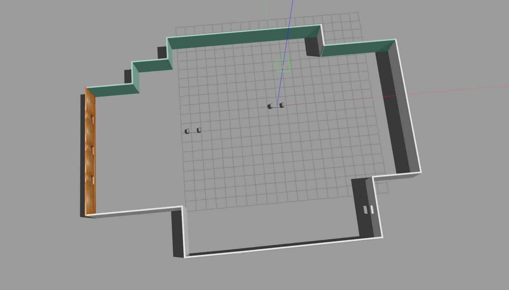

# Robotics

## This repo is a collection of projects related to robotics

### 1. [Build My World](https://github.com/shengchen-liu/RoboND-Build-My-World)

Design a Gazebo World Environment by including multiple models and use it as a base for all upcoming projects.

### 2. [Go Chase It!](https://github.com/shengchen-liu/RoboND-Go-Chase-It)

Design and build a mobile robot, and house it in your world.  Then program your robot with c++ nodes in ROS to chase white colored balls.

